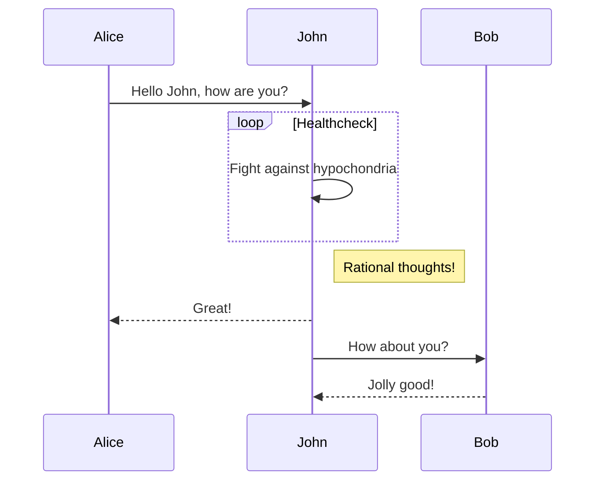
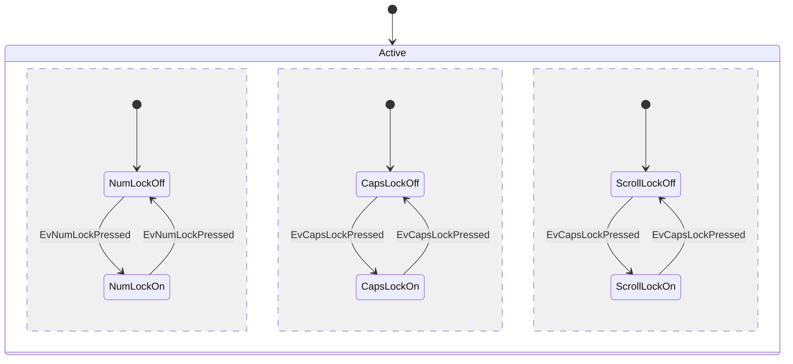

# 字符效果

* ~~删除线~~ <s>删除线（开启识别HTML标签时）</s>

* *斜体字* _斜体字_
* **粗体** __粗体__
* ***粗斜体*** ___粗斜体___

* 上标：X<sub>2</sub>，下标：O<sup>2</sup>

* ==高亮==

* `Inline Code`

> 引用：如果想要插入空白换行（即 `<br>` 标签），在插入处先键入两个以上的空格然后回车即可


#  超链接
* [普通链接](https://www.cnblogs.com/zhiyiYo/)
* [*斜体链接*](https://www.cnblogs.com/zhiyiYo/)
* [**粗体链接**](https://www.cnblogs.com/zhiyiYo/)

# 脚注
这是一个简单的脚注 [^1] 而这是一个更长的脚注 [^bignote].

[^1]: 这是第一个脚注.

[^bignote]: 这是一个非常长长长长长长长长长长长长长长长长长长长长长长长长长长长长长长长长长长长长长长长长长长长长长长长长长长长长长长长长长长长长长长的脚注.


# 图像
下面是一张我家硝子的壁纸😊:

再来一张好了😊：


# 代码

## 行内代码
在 VS Code 中按下 <kbd>Alt</kbd> + <kbd>T</kbd> + <kbd>R</kbd> 执行命令：`npm install marked`

## 代码片

### Python 代码
```python
class Animal:
    """ 动物类 """

    def __init__(self, age: int, name: str):
        self.age = age
        self.name = name

    def getInfo(self) -> str:
        """ 返回信息 """
        return f'age: {self.age}; name: {self.name}'


class Dog(Animal):
    """ 狗狗类 """

    def __init__(self, age: int, name: str, gender='female', color='white'):
        super().__init__(age, name)
        self.gender = gender
        self.__color = color

    def bark(self):
        """ 狗叫 """
        print('lololo')

    @property
    def color(self):
        return self.__color

    @color.setter
    def color(self, color: str):
        if color not in ['red', 'white', 'black']:
            raise ValueError('颜色不符合要求')
        self.__color = color


if __name__ == '__main__':
    dog = Dog(16, '啸天', gender='male')
    # 狗叫
    dog.bark()
    # 设置狗狗毛色
    dog.color = 'blue'
```

### HTML 代码

```html
<!DOCTYPE html>
<html>
    <head>
        <mate charest="utf-8" />
        <title>Hello world!</title>
    </head>
    <body>
        <h1>Hello world!</h1>
    </body>
</html>
```


# 列表

## 无序列表

* 福建
  * 厦门
  * 福州
* 浙江
* 江苏
## 有序列表

1. 动物
   1. 人类
   2. 犬类
2. 植物
3. 微生物

## 任务列表

- [x] 预习计算机网络
- [ ] 复习现代控制理论
- [ ] 刷现代控制理论历年卷
    - [ ] 2019 年期末试卷
    - [ ] 2020 年期末试卷


# 表格

| 项目   |  价格 | 数量  |
| ------ | ----: | :---: |
| 计算机 | $1600 |   5   |
| 手机   |   $12 |  12   |
| 管线   |    $1 |  234  |

----

# 特殊符号

&copy; &  &uml; &trade; &iexcl; &pound;
&amp; &lt; &gt; &yen; &euro; &reg; &plusmn; &para; &sect; &brvbar; &macr; &laquo; &middot;

X&sup2; Y&sup3; &frac34; &frac14;  &times;  &divide;   &raquo;

18&ordm;C  &quot;  &apos;

# Emoji表情 :satisfied:
* 马：:horse:
* 星星：:star2:
* 笑脸：:smile:
* 跑步：:running:

# 数学公式

行间公式：
$$\sin(\alpha)^{\theta}=\sum_{i=0}^{n}(x^i + \cos(f))$$
行内公式 $E=mc^2$

# 绘图
## 时序图




## 状态图

